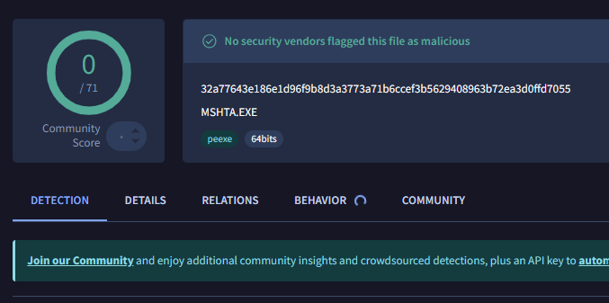
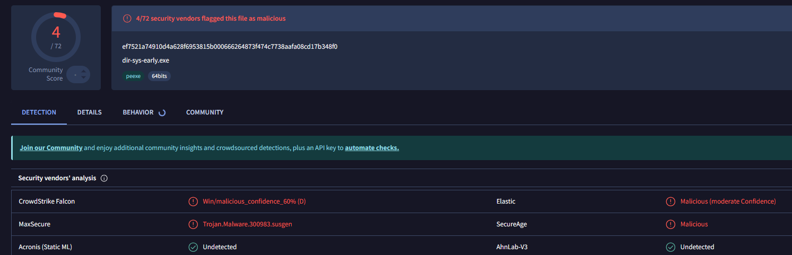
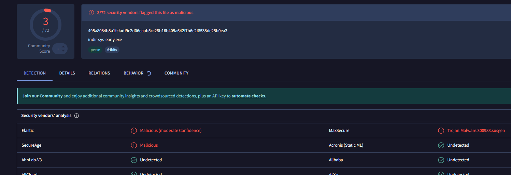
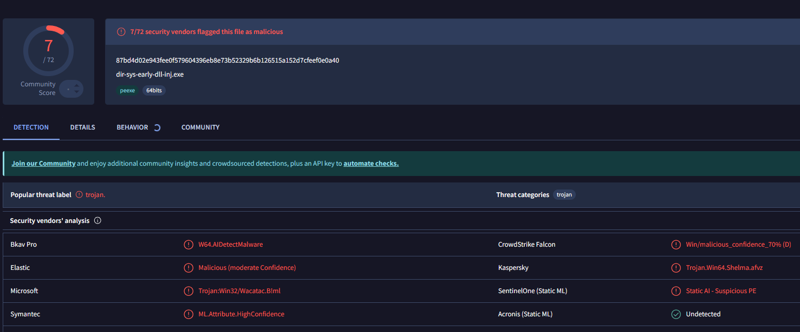
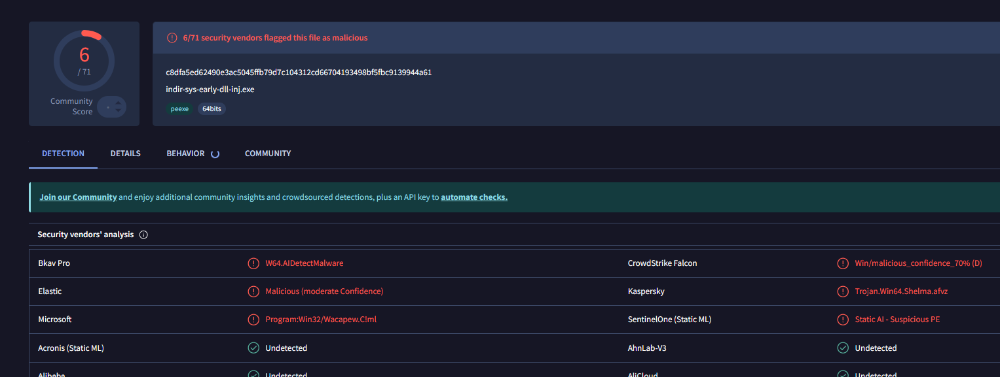

# Syscall Early-Bird Injection Trojans (Direct/Indirect)



Collection of remote shellcode Loaders using Early Bird APC injection, direct/indirect syscalls, ntdll and low level utilities, undetected by Windows Defender and BitDefender. This code is for educational purposes only, do not use it for any malicious or unauthorized activity.

This code is an improved version of [this](https://github.com/Hue-Jhan/Syscall-Apc-Injection-Trojans), and includes both the direct syscall and indirect syscalls version of a classic shellcode injection via APC, its dll version, and a DLL injector queuing LoadLibraryA.

Dont confuse it with [this](https://github.com/Hue-Jhan/Syscall-Apc-Injection-Trojans), which has a similar workflow but a slighly different technique

# 🖥️ Code
This repo is a more advanced version of [this one](https://github.com/Hue-Jhan/Early-Bird-Process-and-Dll-injection/), it consists of 6 projects that have the same basic structure and share most of the code, they are: Nt Early bird APC injection, DLL version, and a DLL Injector (LoadLibrary using APC), each of them having the direct/indirect syscalls version. The shellcode is for a windows msg box, and every code includes 2 versions, one with NtCreateUserProcess (stealthier, low level, using syscalls), and an old one with RtlCreateUserProcess (higher level but easier to manage, dont uncomment it).

Next to each code as you can see i put the virus total detections for its raw executable.

### 0) Direct & Indirect System Calls Explained

On Windows, native API functions inside `ntdll.dll` ultimately execute a syscall instruction to transition from user mode to kernel mode. Because standard WinAPI wrappers and ntdll exports are heavily monitored by user-mode EDR hooks, this architecture bypasses them by dynamically resolving System Service Numbers (SSNs) at runtime. This is not full ntdll unhooking; rather than rewriting functions, it bypasses user-mode prologue hooks (`jmp`) by constructing clean, custom execution stubs containing the target SSN (`mov eax, SSN`).

```asm
mov r10, rcx
mov eax, 0x00001BE    ; SSN
syscall
```
Direct syscalls execute the kernel transition directly from application space. Indirect syscalls locate a valid, unhooked native syscall instruction inside ntdll.dll and jump to it after setting the SSN, keeping instruction pointers aligned closer to expected operating system boundaries. It requires custom typedef definitions for each function, along with all nested internal structures and objects required by them. 

#### Manual PE Parsing (GetProcAddressManualEx)

To resolve native procedures without calling standard Windows APIs, I used `GetProcAddressManualEx()`, a custom function made by ChatGPT- ehm, me, that parses the PE headers and walks the export directory directly from memory. The breakdown of this process includes:

1. **DOS Header:** Read the DOS header and use `e_lfanew` to locate the NT headers.
2. **NT Headers:** At `base + e_lfanew`, find the NT headers (signature + `IMAGE_FILE_HEADER` + `IMAGE_OPTIONAL_HEADER`). The optional header contains the DataDirectory array.
3. **Export Directory RVA:** `OptionalHeader.DataDirectory[IMAGE_DIRECTORY_ENTRY_EXPORT]` provides the RVA and size of the Export Directory (`base + rva` points to the `IMAGE_EXPORT_DIRECTORY` in memory).
4. **Directory Arrays:** The Export Directory contains three core lists:
   * `AddressOfNames`: Array of RVAs to ASCII function names (e.g., `nameRvas[i] = "LoadLibraryA"`).
   * `AddressOfNameOrdinals`: Array where each index corresponds to a function name and points to its ordinal (`ordinals[i] = index into AddressOfFunctions`).
   * `AddressOfFunctions`: Array of RVAs pointing to the real exported functions (`funcRvas[ordinal] = RVA of the actual function`).

So to resolve a name we find the name in the AddressOfNames array, get its ```ordinals[i]``` value (index), read ```funcRvas[ordinals[i]]```, and convert the function RVA to an absolute address by adding the module base: ```funct_add = base + funcRvas[ordinals[i]]```. 

> [!NOTE]
> If funcRva points back inside the export directory region then the entry is a forwarded export, in this case and in other special cases like failing to validates the DOS header magic (MZ) and the PE signature, or if the RVA is too big, the function simply returns null.

### 1) Early Bird Simple Process Injection  

Spawns a process in a suspended state and queues shellcode to its main thread before execution begins:

1. First the shellcode is decrypted (for details on the crypter mechanism, check out this repository);
2. Secondly, we build the necessary structures and spawn a target process in a suspended state using NtCreateUserProcess via syscalls;
3. We obtain handles to the target process and its main thread; 
4. Then we perform memory operations (Allocate -> Write/Copy -> Protect RWX) inside it using our custom syscall routines;
5. Finally, we queue the shellcode to the main thread (NtQueueApcThread) and resume the process, forcing the payload to execute before the entry point is reached.

### 2) DLL Version 
The DLL variant operates identically within the process it is loaded into, using GetCurrentProcessId() to target its host environment. 

>Spawning a new execution thread outside the loader lock is essential to avoid deadlocks. Try to disable precompiled headers in Visual Studio build configs to eliminate .pch build errors. Note that this DLL might occasionally fail if injected via its companion Early Bird injector variant.

### 3) DLL Injection via Early Bird 
Spawns a suspended process and loads a malicious DLL into it by queueing LoadLibraryA via an Early Bird APC:

1. The DLL (treated as a resource) is extracted from the executable, written to disk, and its path, size, and name lengths are calculated;
2. We spawn the target process in a suspended state and secure a handle to its main thread;
3. Memory matching the length of the DLL path is allocated inside the target process, the path string is written, and permissions are modified to RWX;
4. We retrieve the base address of kernel32.dll to find the pointer for LoadLibraryA; 
5. Finally, we queue LoadLibraryA (pointing to the DLL path string) to the suspended main thread using an APC, then resume the process.
   
(Note: This technique may fail if the supplied DLL itself relies on conflicting Early Bird routines).

# 🛡️ AV Detection


Executables easily bypass static signatures from Windows Defender and BitDefender out of the box, especially when metadata is aligned or wrapped using native utility signatures (e.g., Mshta.exe or custom MSI packages).

However, behavioral monitors like Bitdefender Advanced Thread Defense (ATD) may block execution because:

- When the CPU hits the custom syscall instruction stub inside application memory, the call stack reveals an abnormal transition (the return address points to user-space code instead of the interior of ntdll.dll), triggering stack-pivoting or abnormal syscall heuristics.

- Manual PE Export Directory parsing and memory scanning of ntdll.dll for instruction opcodes (0xB8, 0x0F 0x05) can raise behavioral suspicion levels, silently interrupting execution flows.

- Modern kernel tracing (ETW) and hardware controls like Intel CET (Control-flow Enforcement Technology) track indirect branch execution and shadow stacks, ensuring robust kernel-level visibility against non-standard execution paths.
